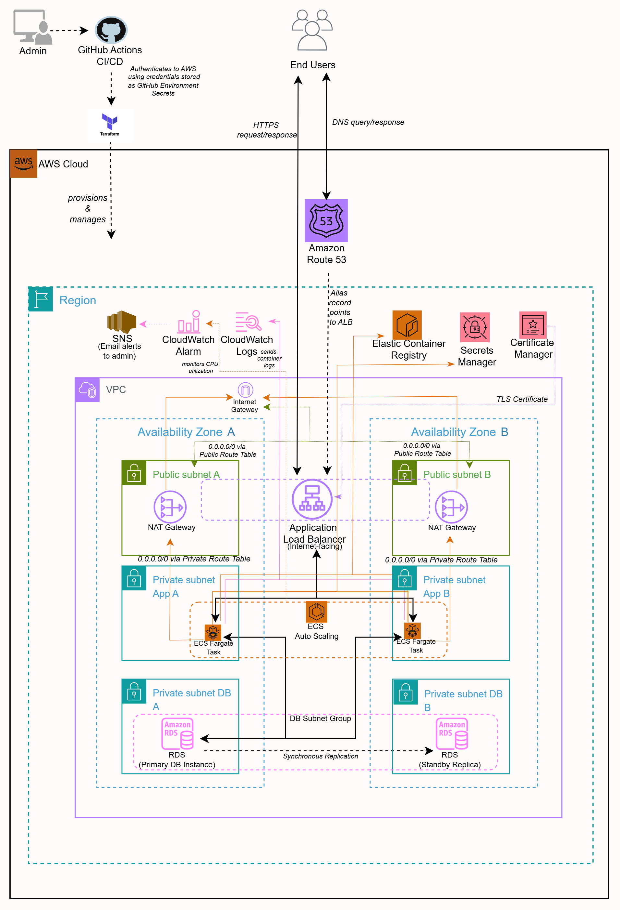
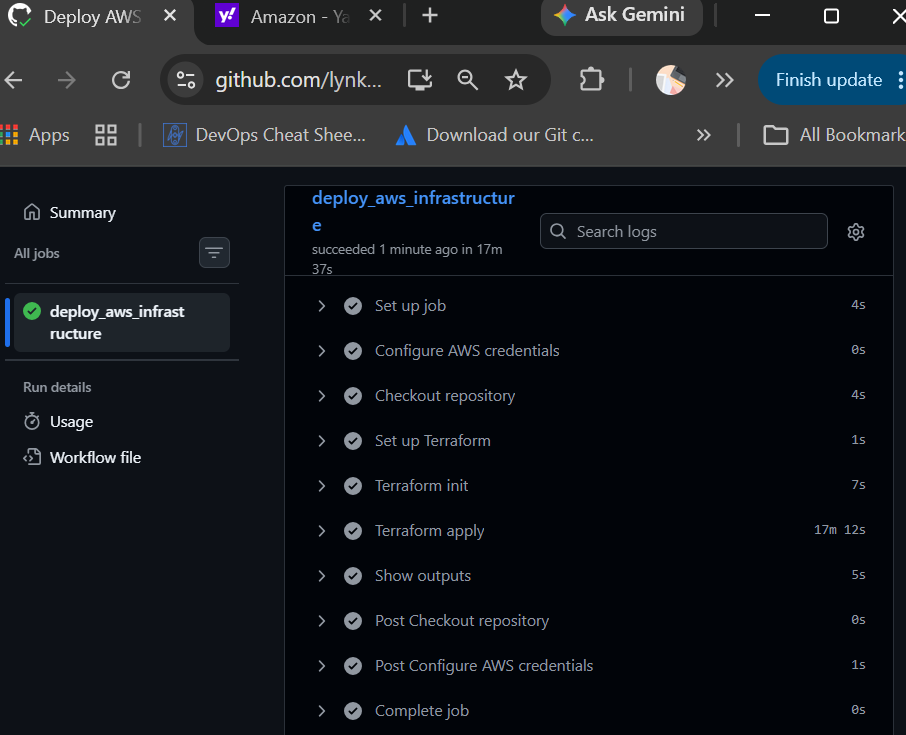
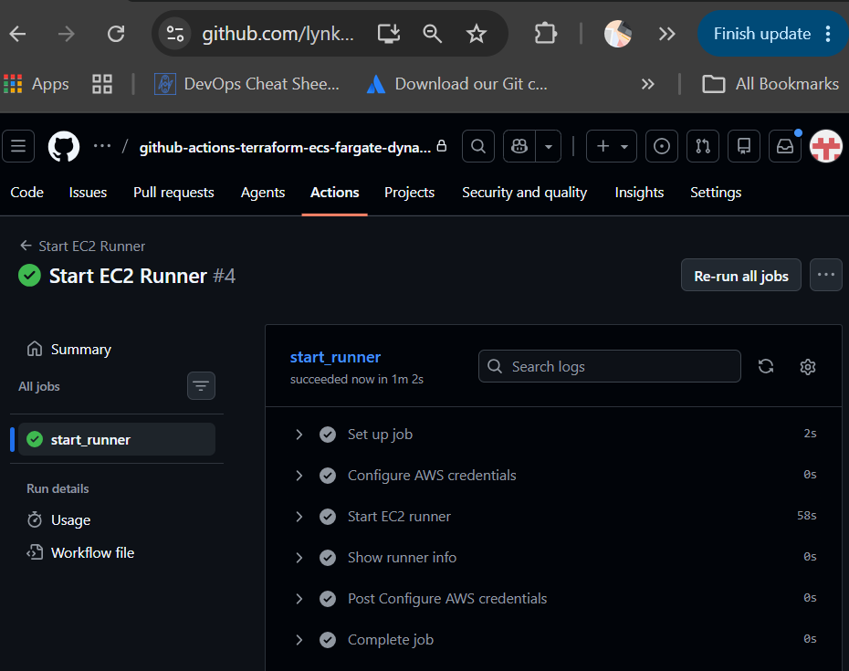
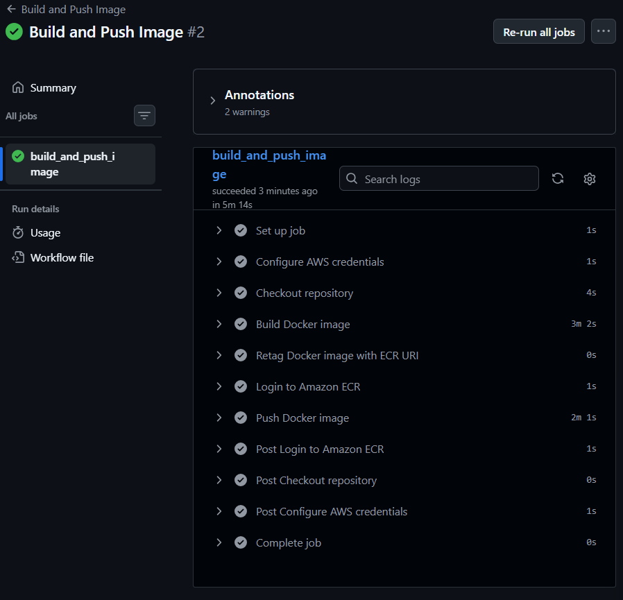
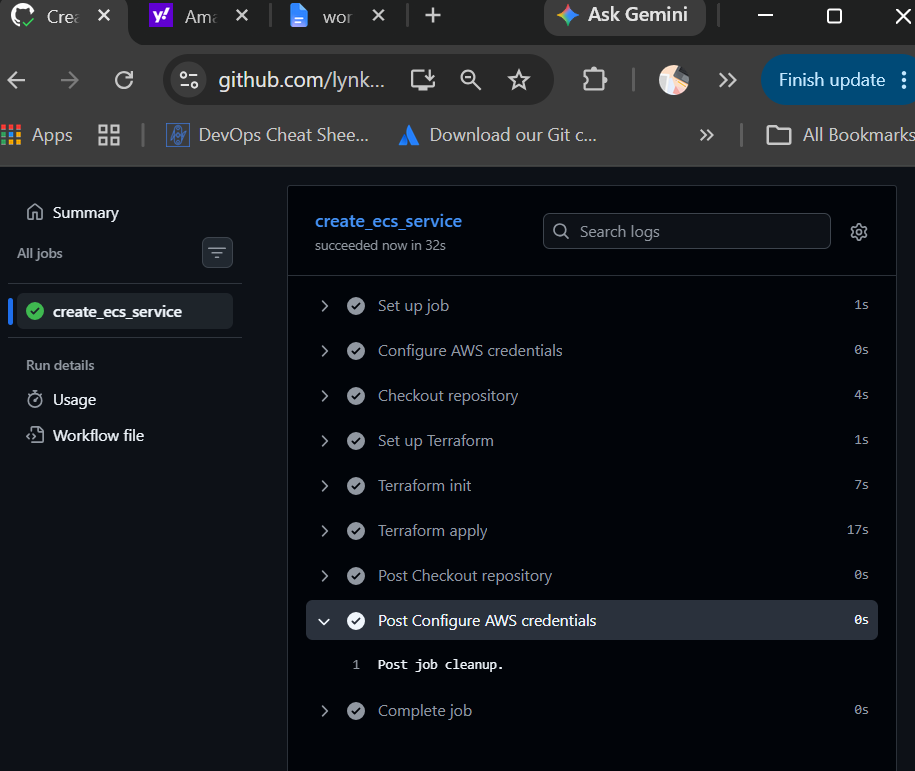
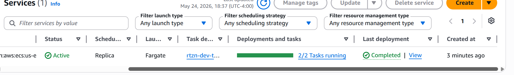
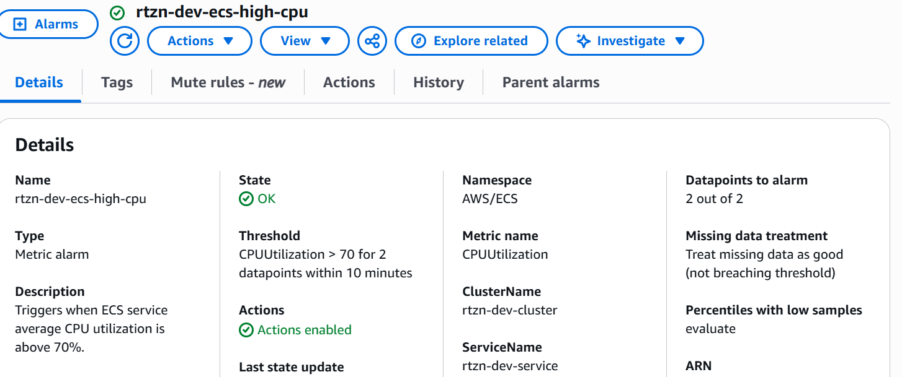
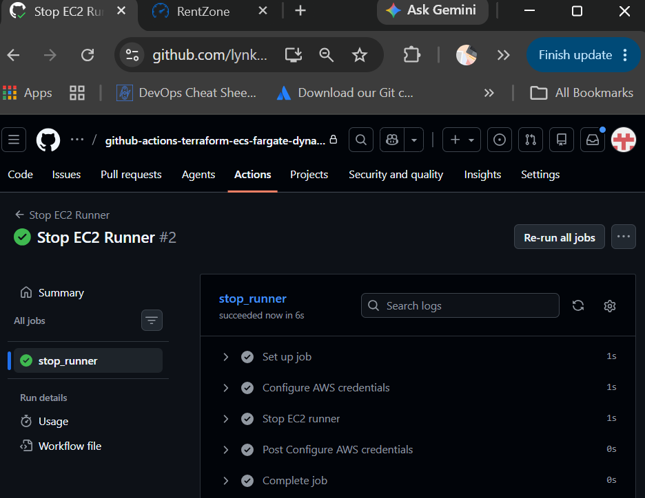
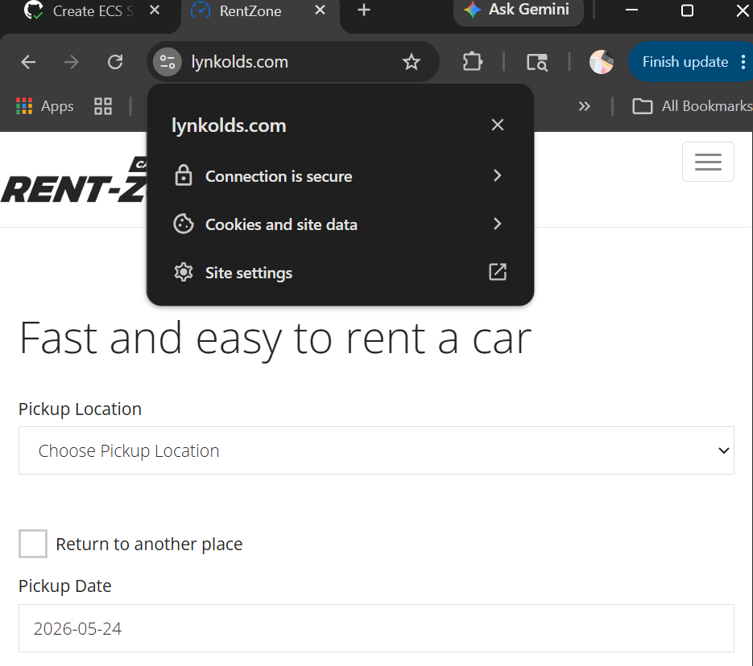
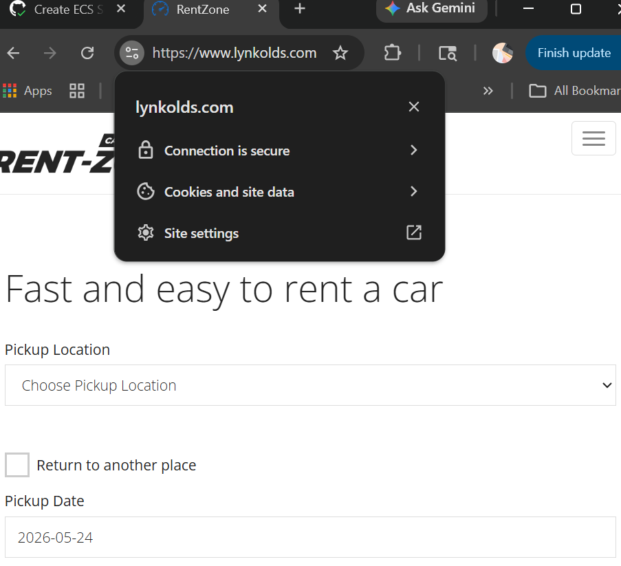

# Production-Ready AWS Dockerized Dynamic Web App Deployment with Github Actions and Terraform

<a id="architecture-diagram"></a>



## Project Overview

This project demonstrates how to deploy a Dockerized dynamic web application on AWS using Terraform and GitHub Actions.

It follows a production-style architecture with:

- Amazon ECS (Fargate) for containerized workloads
- Amazon RDS (restored from snapshot) for database
- AWS Secrets Manager for secure configuration (pre-existing secrets)
- Application Load Balancer (ALB) with HTTPS (ACM)
- Route 53 for domain routing
- GitHub Actions for CI/CD (workflow_dispatch)

Once deployed, the application is accessible immediately via the domain.

## Table of Contents

1. [Architecture Diagram](#architecture-diagram)
2. [Project Overview](#project-overview)
3. [Core Services and Technologies](#core-services-and-technologies)
4. [Key Characteristics](#key-characteristics)
5. [Architecture Overview](#architecture-overview)
6. [Prerequisites](#prerequisites)
7. [Secrets Management](#secrets-management)
6. [Infrastructure Components](#infrastructure-components)
9. [Repository Structure](#repository-structure)
10. [Deployment Guide](#deployment-guide)
11. [Verification Checklist](#verification-checklist)
12. [Cleanup](#cleanup)
13. [Notes & Best Practices](#notes--best-practices)

## Core Services and Technologies

- Docker (Containerization)
- Amazon ECR (Image Registry)
- Amazon ECS Fargate (Serverless Containers)
- Amazon RDS (Managed Database)
- AWS Secrets Manager (Secure Config)
- Amazon VPC (Networking)
- Application Load Balancer (Traffic Routing)
- Amazon Route 53 (DNS)
- AWS Certificate Manager (HTTPS)
- Terraform (Infrastructure as Code)
- GitHub Actions – CI/CD

## Key Characteristics

- Uses existing Route 53 domain
- Uses existing ACM certificate
- Uses pre-existing Secrets Manager secret (not created by Terraform)
- Uses RDS snapshot for faster database provisioning
- Uses manual GitHub Actions workflows (workflow_dispatch)
- Infrastructure as Code

---

## Architecture Overview

### Request Flow
```
Users  
↓  
Route 53 (DNS)  
↓  
Application Load Balancer  

- HTTP (80) → Redirect → HTTPS (443)  
- HTTPS (443) → Forward → ECS  

↓  
ECS Fargate Tasks  
↓  
Amazon RDS (Snapshot-based DB)
```

### Runtime Behavior

- HTTP (80) → Redirects to HTTPS (443)
- ECS pulls Docker image from ECR
- Secrets are retrieved from AWS Secrets Manager at runtime
- Application connects to RDS using injected endpoint

## Prerequisites

- AWS Account
- Existing Route 53 domain
- Existing ACM certificate (validated)
- Existing RDS snapshot
- AWS CLI configured
- Docker installed
- Terraform installed
- GitHub account
- Git configured
- Pre-existing secrets in AWS Secrets Manager
- Pre-existing S3 bucket (for Terraform remote state storage)
- Pre-existing DynamoDB table (for Terraform state locking and concurrency protection)

## Secrets Management
Secrets are pre-created in AWS Secrets Manager and referenced by Terraform/ECS.

Expected Secret Values

```
APP_NAME
# Name of the application
# Example:
# rentzone


APP_URL
# Public application URL
# Example:
# https://www.example.com


DB_HOST
# RDS database endpoint / hostname
# Example:
# rentzone-db.c123abcxyz.us-east-1.rds.amazonaws.com


DB_PORT
# Database port
# MySQL default: 3306


DB_DATABASE
# Name of the application database
# Example:
# rentzone_db

DB_USERNAME
# Database username used by the application

DB_PASSWORD
# Database password used by the application

CONTAINER_IMAGE
# Full Amazon ECR container image URI
# Example:
# 123456789012.dkr.ecr.us-east-1.amazonaws.com/rentzone-repo:latest


CERTIFICATE_ARN
# Existing ACM certificate ARN used for HTTPS
# Example:
# arn:aws:acm:us-east-1:123456789012:certificate/xxxxxxxx-xxxx-xxxx-xxxx-xxxxxxxxxxxx

SNS_EMAIL
# Email address for ECS-high-CPU SNS subcription
# Example:
# admin@example.com

SSH_IP
# Public IP address allowed to SSH via selfhosted runner sg
#
# Tip:
# Use:
# curl.exe ifconfig.me
# to get your current public IP
```

## Infrastructure Components
Terraform provisions:
* VPC (Multi-AZ)
* Public subnets (ALB, NAT)
* Private subnets (ECS)
* DB subnets (RDS)
* Internet Gateway + NAT Gateways
* Route tables
* Security groups
* Application Load Balancer
* ECR repository
* RDS (from snapshot)
* Secrets injection using existing AWS Secrets Manager secrets
* ECS Cluster (Fargate)
* ECS Service + Task Definition
* ECS Service Auto Scaling
* CloudWatch Log Group
* SNS Topic + Email Subscription for ECS Alerts
* CloudWatch Alarm for ECS CPU Monitoring


> Note: Secrets Manager secrets are referenced and consumed by this infrastructure, but are not created by Terraform in this project.

### GitHub Actions CI/CD
Workflow Type

This repository uses `workflow_dispatch` workflows to enable controlled and intentional CI/CD executions for infrastructure provisioning, application containerization and deployments.


Pipeline Overview
```
Manual Trigger
   ↓
iac.yml           → Deploys core infrastructure (no ECS yet)
startrunner.yml   → Starts EC2 self-hosted runner
builddocker.yml   → Builds + pushes Docker image to ECR
ecs.yml           → Deploys ECS service
stoprunner.yml    → Stops EC2 runner
```

Key Pipeline Concepts

1. Self-Hosted Runner
- EC2-based GitHub runner
- Required for:
  - Docker builds
  - Private subnet access (RDS)
2. GitHub Secrets

Stored in GitHub repository:
```
AWS_ACCESS_KEY_ID
AWS_SECRET_ACCESS_KEY
PERSONAL_ACCESS_TOKEN
ECR_REPOSITORY_URI (output from iac.yml workflow)
```

3. Terraform in CI/CD

- `terraform apply/destroy` is controlled via variable
- Outputs exported for pipeline use

## Repository Structure
```
project-root/
├── .github/workflows/          # GitHub Actions CI/CD pipelines
├── assets/rentzone/            # Dockerized application source and scripts
│   ├── Dockerfile
│   ├── AppServiceProvider.php
│   └── rentzone.zip
├── images/                     # Architecture diagrams and screenshots
├── terraform/                  # Infrastructure code
│   ├── iac/
│   └── next-iac/
├── .gitignore
└── README.md
```
---

## Deployment Guide
##  1. Configure Terraform 

### Terraform State Management
This project uses a remote backend:
- S3 bucket → stores Terraform state
- DynamoDB table → provides state locking

The S3 bucket and DynamoDB table must be created before running `terraform init` on the main `iac/`folder for the project.
  
#### In `iac.yml`, modify:
```
# ==========================================================
# VPC / NETWORKING VARIABLES
# ==========================================================
TF_VAR_region: "us-east-1"
TF_VAR_project_name: ""
TF_VAR_environment: ""

TF_VAR_vpc_cidr: "10.0.0.0/16"
TF_VAR_public_subnet_az1_cidr: "10.0.0.0/24"
TF_VAR_public_subnet_az2_cidr: "10.0.1.0/24"
TF_VAR_private_app_subnet_az1_cidr: "10.0.2.0/24"
TF_VAR_private_app_subnet_az2_cidr: "10.0.3.0/24"
TF_VAR_private_data_subnet_az1_cidr: "10.0.4.0/24"
TF_VAR_private_data_subnet_az2_cidr: "10.0.5.0/24"

# ==========================================================
# RDS VARIABLES
# ==========================================================
TF_VAR_database_snapshot_identifier: "" # identifier of the RDS snapshot used to restore the database
TF_VAR_database_instance_class: "" 
TF_VAR_database_instance_identifier: "" # must match the original instance identifier from the snapshot for endpoint consistency
TF_VAR_multi_az_deployment: "" # boolean. true  = high availability enabled, false = single AZ deployment


# ==========================================================
# APPLICATION LOAD BALANCER VARIABLES
# ==========================================================
TF_VAR_target_type: "ip"

# ==========================================================
# ECR VARIABLES
# ==========================================================
# Name of the ECR repository to create
TF_VAR_repo_name: ""

TF_VAR_image_tag_mutability: "IMMUTABLE"
TF_VAR_force_delete: true
TF_VAR_scan_on_push: true
TF_VAR_enable_lifecycle_policy: true
TF_VAR_lifecycle_keep_last_n: 30

TF_VAR_tags: '{"Project":""}'

# ==========================================================
# ROUTE53 VARIABLES
# ==========================================================
TF_VAR_domain_name: ""
TF_VAR_record_name: "www"

# ==========================================================
# SECRET
# ==========================================================
TF_VAR_docker_env_secret_name: "" # name of the existing secret in secrets manager.
```
#### In `ecs.yml` file, modify: 

```
# ==========================================================
# VPC / NETWORKING VARIABLES
# ==========================================================
TF_VAR_region: "us-east-1"
TF_VAR_project_name: ""
TF_VAR_environment: ""

TF_VAR_vpc_cidr: "10.0.0.0/16"
TF_VAR_public_subnet_az1_cidr: "10.0.0.0/24"
TF_VAR_public_subnet_az2_cidr: "10.0.1.0/24"
TF_VAR_private_app_subnet_az1_cidr: "10.0.2.0/24"
TF_VAR_private_app_subnet_az2_cidr: "10.0.3.0/24"
TF_VAR_private_data_subnet_az1_cidr: "10.0.4.0/24"
TF_VAR_private_data_subnet_az2_cidr: "10.0.5.0/24"

# ==========================================================
# RDS VARIABLES
# ==========================================================
TF_VAR_database_snapshot_identifier: "" # identifier of the RDS snapshot used to restore the database
TF_VAR_database_instance_class: "" 
TF_VAR_database_instance_identifier: "" # must match the original instance identifier from the snapshot for endpoint consistency
TF_VAR_multi_az_deployment: "" # boolean. true  = high availability enabled, false = single AZ deployment


# ==========================================================
# APPLICATION LOAD BALANCER VARIABLES
# ==========================================================
TF_VAR_target_type: "ip"

# ==========================================================
# ECR VARIABLES
# ==========================================================
# Name of the ECR repository to create
TF_VAR_repo_name: ""

TF_VAR_image_tag_mutability: "IMMUTABLE"
TF_VAR_force_delete: true
TF_VAR_scan_on_push: true
TF_VAR_enable_lifecycle_policy: true
TF_VAR_lifecycle_keep_last_n: 30

TF_VAR_tags: '{"Project":""}'

# ==========================================================
# ROUTE53 VARIABLES
# ==========================================================
TF_VAR_domain_name: ""
TF_VAR_record_name: "www"

# ==========================================================
# SECRET
# ==========================================================
TF_VAR_docker_env_secret_name: "" # name of the existing secret in secrets manager.

# ==========================================================
# ECS
# ==========================================================
TF_VAR_cpu_architecture: "X86_64"
TF_VAR_container_name: "latest" # Name of the container to launch inside the ECS task definition
TF_VAR_ecs_service_max_capacity: "4" # Maximum number of ECS tasks autoscaling can run
TF_VAR_ecs_service_min_capacity: "1" # Minimum number of ECS tasks autoscaling keeps running
TF_VAR_ecs_desired_count: "2" # Starting number of ECS tasks when the service is created

```
## 2. Configure GitHub Secrets and Variables
Add secrets:
```
AWS_ACCESS_KEY_ID
AWS_SECRET_ACCESS_KEY
PERSONAL_ACCESS_TOKEN
```
Add variables:
```
TF_STATE_BUCKET
TF_STATE_KEY
TF_LOCK_TABLE
```

## 3. Run Workflows (Order Matters)

### Step 1: Infrastructure as code
- In `iac.yml`, modify environment name.
- Commit and run `Deploy AWS Infrastructure` workflow.
- Note the value of ECR_REPOSITORY_URI from output and add as environment secret on Github.



---
### Step 2: Prepare Runner

Follow instructions at:
https://github.com/machulav/ec2-github-runner

    - Launch EC2
    - Install Docker + Git
    - Create AMI
    - Create IAM role (ECR permissions)


### Step 3: Start Runner
In `startrunner.yml`,
- Modify environment name.
- Update inputs:
```
ec2-image-id: # AMI id of AMI created in Step 3.
ec2-instance-type: # t3.micro is sufficient
subnet-id: # private_app_subnet_az1_id...output from iac.yml job
security-group-id: # runner_security_group_id...output from iac.yml job
iam-role-name:  # instance profile of IAM role created in Step 3.
```

- Commit and run `Start EC2 Runner` workflow.
- Note the values of "Runner label" and "EC2 instance id".



---
### Step 4: Build Docker Image
In `builddocker.yml`,
- Modify environment name.
- Modify the value of `runner_label` with the output from `startrunner.yml`.
- Commit and run `Build and Push Image` workflow.



---
### Step 5: Deploy ECS
- Add the ecs.tf and asg.tf files in next-iac/ to iac/
- In `variables.tf`, create variables for:
```
cpu_architecture
container_name
ecs_service_max_capacity
ecs_service_min_capacity
ecs_desired_count

```
In `ecs.yml`,
- Modify environment name.
- Commit and run `Create ECS Service` workflow.


---

---

---
### Step 6: Stop Runner
In `stoprunner.yml`,
- Modify environment name.
- Modify the value of `runner_label` and `ec2_instance_id` with the output from `startrunner.yml`.
- Commit and run `Stop EC2 Runner` workflow.


---
Validate Deployment
* https://domainname 


---
* https://www.domainname


---
## Verification Checklist

- ECS tasks running
- Target group healthy
- Domain loads application
- HTTPS working
- Database connection successful
- Secrets injected correctly
- Confirm SNS subscription

## Cleanup 

### To destroy infrastructure:
- In `rds.tf`, under lifecycle, change `prevent_destroy = true` to `prevent_destroy = false`.
- Run the `Deploy AWS Infrastructure` workflow to apply the change to the RDS instance.
- Set `TERRAFORM_ACTION` to `destroy` in `iac.yml`.
- Run the `Deploy AWS Infrastructure` workflow to destroy all resources.

## Notes & Best Practices

- Use S3 + DynamoDB for remote state
- Keep ECS tasks in private subnets
- Use Secrets Manager for sensitive data and database password rotation.
- Enforce HTTPS via ALB redirect
- Use manual workflow triggers for controlled deployments
- Do not commit .tfstate and .tfvars files.